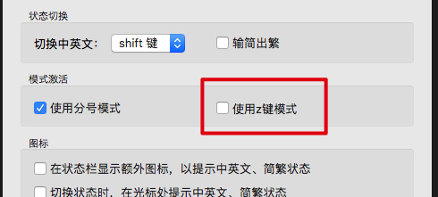

清歌输入法 之 小鹤音形词库
======================

根据清歌输入法的词库规则，生成了小鹤双拼（音形）的词库，这样就可以在清歌输入法使用小鹤了。

为什么要在一个五笔输入法中使用双拼？
------------------

因为其它的双拼输入法我都试过了，都有不符合我心意的理由：

- 落格输入法（付费购买）：词库管理功能太弱，加词删词太不方便。对于一个需要精心维护词库的双拼加辅助码用户来说，这个问题是致命的，也是导致我放弃落格

注意
---

需要禁用清歌的`z`模式，才能正常使用：

